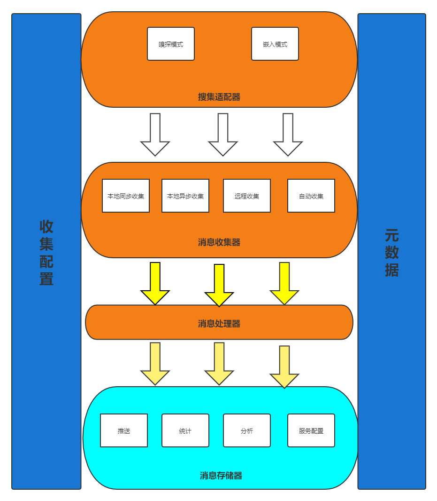

### 日志收集报警组件simple-alert
    
### 背景
    很多公司上线一个项目后，由于缺少对项目运行情况的监管，导致很多生产问题都是后知后觉，一般由使用者告知系统有bug,这个时候才知道去修复漏洞，但一旦修复不及时，则会造成不小的损失
### 无缝接入
    1.支持原生收集
    2.支持原生fegin
    3.支持服务发现支持
### 1.0功能
    1.支持简单的配置
    2.定义元数据,可支持扩展
    3.支持自定义接入
    4.收集器简单开发
    5.报警器简单开发
### 接入
    参考simple-alert-example工程
### 架构图

   
